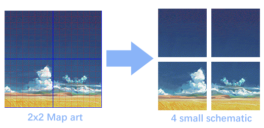
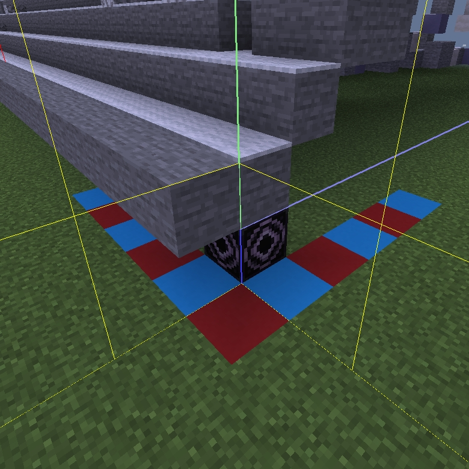

# MapArtSchematicSpliter

A python script to split a big [MapartCraft](https://rebane2001.com/mapartcraft/) schematic into individual map-sized schematics.




This script was made to cut schematic into small pieces so that mod like Create will allow you to upload it when the original file was too large. Or for multiple workers to build the map art faster.

Although MapartCraft has a split function but it needs you to place the schematics horizontally to avoid any unwanted shadow. If you don't care it then it's find, but in some case you may want it to keep it's original layout, like display more comfortably on minimap mod. Just it nothing else ¯\\\_(ツ)\_/¯

# Requirements

```bash
$ pip install -r requirements.txt
```

The script need [nbtlib](https://github.com/vberlier/nbtlib) to work which needs python 3.8 or up.

# Usage

```bash
$ python spliter.py <nbt file>
```

This will output multiple numbered schematic files with column-major ordering.

For example a 2x2 map art `foo.nbt` will output `foo_0.nbt` `foo_1.nbt` `foo_2.nbt` and `foo_3.nbt`. And the layout in the minecraft world will be like:

```
|-----------------------|
| foo_0.nbt | foo_2.nbt |
|-----------|-----------|
| foo_1.nbt | foo_3.nbt |
|-----------------------|
```


Every schematics will be 128x128 large, and the start point is the top left corner. The only exception is the schematics on the top row which is 129x128 large (due to an additional layer in the beginning). But for the convenience, the start point still aligns with the map as shown in the following image.

